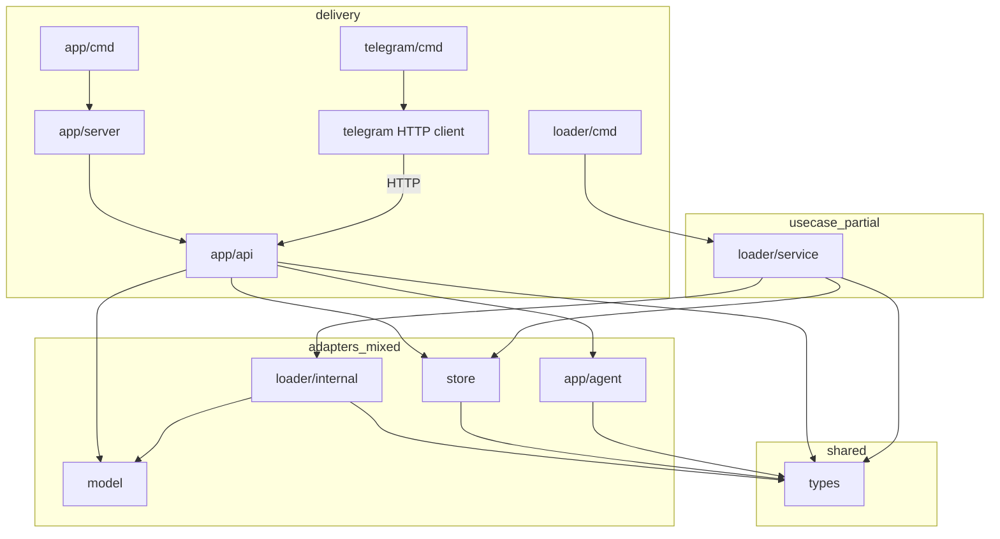

# Architecture Review — RAG

Дата: 2026-07-21  
Область: `app/`, `loader/`, `store/`, `model/`, `types/`, `telegram/` (без `tmp/`, бинарников, `.env`)

## 1. Executive summary

Репозиторий — pragmatic Go-монорепо с тремя бинарниками (server, loader, telegram) и ранними зёрнами Clean Architecture: `store.DBStorer`, `model.EmbedderInterface`, `model.VisionModel`, composition roots в `cmd`/`server.Run`.

Главный разрыв — **нет слоя use case**. RAG-пайплайн живёт в Fiber-handler (`app/api/handler.go`), ingest-логика смешана с Docling/FS в `loader/internal`, а пакет `types` одновременно несёт domain, HTTP DTO и SQL/Docling-типы. Порт репозитория объявлен в infra-пакете `store`, LLM вызывается напрямую из `agent` без интерфейса.

Вердикт: **не Clean Architecture**, но база для эволюционной миграции хорошая. Не делать big-bang rewrite — идти по приоритетам из §6.

## 2. Текущая карта архитектуры



### Карта импортов (project packages)

| Пакет | Импортирует |
|-------|-------------|
| `types`, `model`, `app/middleware` | — |
| `store` | `types` |
| `app/agent` | `types` |
| `app/api` | `agent`, `model`, `store`, `types` |
| `app/server` | `api`, `middleware`, `store` |
| `app/cmd` | `server` |
| `loader/internal` | `model`, `types` |
| `loader/service` | `internal`, `store`, `types` |
| `loader/cmd` | `service`, `store` |
| `telegram/cmd` | `types` |

## 3. Нарушения Dependency Rule

| Нарушение | Где | Суть |
|-----------|-----|------|
| Use case в delivery | `app/api/handler.go` | embed → search → filter → context → LLM в handler |
| Domain ← SQL | `types.Chunk` | `sql.Null*`, `uuid.NullUUID` |
| Domain ← HTTP | `types/query.go` | `net/http` в валидации |
| Domain ← Docling | `types.DoclingResponse` | wire-формат внешнего API |
| Port в infra | `store.DBStorer` | потребители тянут пакет адаптера |
| Нет LLM-порта | `app/api` → `agent.*` | прямые вызовы, нет подмены в тестах |
| Self-wiring | `NewRequestHandler`, `NewPDFLoader` | конструкторы сами создают Ollama-клиенты |
| UC → concrete | `loader/service.Service.loader *PDFLoader` | нет порта DocumentLoader |
| Secrets в коде | `app/agent.GenerateAnswerCohere` | API key захардкожен |

## 4. Findings

### [Critical] Хардкод секрета Cohere API key

- Где: `app/agent/agent.go` (`GenerateAnswerCohere`)
- Что: ключ и URL зашиты в исходники
- Почему: security + конфиг должен жить вне адаптера
- Как: вынести в env/secret; ротировать ключ; передавать через composition root
- Effort: S

### [Critical] RAG use case в HTTP handler

- Где: `app/api/handler.go` — `HandleRequest` (+ `filterChunks`, `extendChunks`, `buildContext`, …)
- Что: delivery оркестрирует весь пайплайн и дергает `store`/`model`/`agent`
- Почему: ломает Dependency Rule, блокирует unit-тесты без Fiber/LLM/DB
- Как: извлечь `internal/usecase/query`; handler: parse → validate → `uc.Execute` → JSON
- Effort: M

### [Major] Domain (`types`) знает SQL / HTTP / Docling

- Где: `types/types.go`, `types/query.go`
- Что: `Chunk` на `database/sql`; DTO Docling; HTTP status в валидации
- Почему: domain не должен зависеть от драйверов и протоколов
- Как: чистые типы в `internal/domain`; mapping в `adapter/postgres`; Docling DTO в `adapter/docling`; HTTP DTO в `delivery/http/dto`
- Effort: M

### [Major] Порт репозитория объявлен в `store`

- Где: `store/storage.go` — `DBStorer`, `Configer`
- Что: интерфейс живёт рядом с `PostgresStore`
- Почему: use case вынужден импортировать infra-пакет
- Как: перенести порт в `internal/port` (или рядом с usecase); `store` реализует порт
- Effort: S–M

### [Major] Нет порта LLM / TextProcessor

- Где: `app/api/handler.go`, `app/api/file_handler.go` → `agent.GenerateAnswer*`
- Что: package-level функции без интерфейса
- Почему: нельзя подменить в тестах; delivery знает про Cohere vs Ollama
- Как: `port.AnswerGenerator`, `port.TextProcessor`; адаптеры `ollama`/`cohere`; выбор в `cmd`
- Effort: M

### [Major] DI сломан в конструкторах handlers/loader

- Где: `NewRequestHandler`, `loader/internal.NewPDFLoader`
- Что: внутри создаются `model.NewOllamaEmbedder()` / `NewLLaVA()` + чтение env
- Почему: composition root размазан; сложно тестировать и конфигурировать
- Как: принимать интерфейсы аргументами; env только в `cmd`/`configs`
- Effort: S

### [Major] Loader use case зависит от concrete `*PDFLoader`

- Где: `loader/service/service.go`
- Что: поле `loader *internal.PDFLoader`
- Почему: смена источника (не PDF / не Docling) требует правки use case
- Как: интерфейс `DocumentSource` / `Ingester` в port; `PDFLoader` — адаптер
- Effort: S

### [Major] ConfigHandler кодирует SQL через reflect + `db` tags

- Где: `app/api/config_handler.go`
- Что: delivery строит `map[string]any` по тегам колонок
- Почему: persistence-детали в transport
- Как: usecase `SetConfig` с типизированным partial update; адаптер пишет SQL
- Effort: S–M

### [Minor] Дублирование ValidationError

- Где: `types` и `app/api`
- Как: один тип ошибок валидации на границе delivery; domain — свои sentinel errors
- Effort: S

### [Minor] Schema/migration внутри runtime store

- Где: `PostgresStore.createRagTables` + вызов из loader `Init`
- Как: вынести в `migrations/`; store только CRUD/search
- Effort: M

### [Minor] Package-level Fiber config / magic config IDs

- Где: `app/server/server.go` (`var config`); hardcoded config id `2`/`3` в handlers
- Как: конфиг в composition; id/имена политик — в usecase/config
- Effort: S

### [Nit] Имена пакетов `model` / `agent` вводят в заблуждение

- `model` = Ollama HTTP-клиенты, не domain models
- `agent` = LLM generate, не агентный фреймворк
- Effort: S (rename при миграции в `adapter/ollama` / `adapter/cohere`)

### [Nit] Telegram как HTTP-клиент

- Изоляция от Postgres — хорошо
- Hardcoded `localhost:3000` — вынести в env
- Effort: S

## 5. Целевая архитектура

```
rag/
├── cmd/
│   ├── server/main.go
│   ├── loader/main.go
│   └── telegram/main.go
├── internal/
│   ├── domain/          # Document, Chunk, Config — без sql/http
│   ├── port/            # Repository, Embedder, LLM, Converter, FS
│   ├── usecase/
│   │   ├── query/
│   │   ├── ingest/
│   │   ├── processfile/
│   │   └── config/
│   ├── adapter/
│   │   ├── postgres/
│   │   ├── ollama/
│   │   ├── cohere/
│   │   ├── docling/
│   │   ├── pdf/
│   │   └── fs/
│   └── delivery/
│       ├── http/        # thin Fiber handlers + dto
│       └── telegram/
├── migrations/
└── configs/
```

**Правило зависимостей:**

```
delivery → usecase → port ← adapter
                ↘ domain ↗
cmd/* только wiring (delivery + usecase + adapter + configs)
```

**Запрещённые импорты (целевые):**

- `domain` → нельзя: `database/sql`, `net/http`, fiber, pgx, ollama clients
- `usecase` → нельзя: fiber, pgx, конкретные HTTP-клиенты; только `domain` + `port`
- `adapter/*` → реализует `port`, маппит в/из `domain`
- `delivery` → нельзя: pgx, прямые SQL; только usecase (+ dto)

## 6. План миграции (эволюционно)

1. **Секрет Cohere** — env + ротация ключа (сейчас в git history).
2. **Извлечь `usecase/query`** из `RequestHandler` без смены публичного HTTP API.
3. **Перенести `DBStorer` → `port`**, оставить реализацию в postgres-адаптере (можно временно re-export).
4. **Добавить `port.AnswerGenerator`**, обернуть текущий `agent`.
5. **Инъекция embedder/vision** в handler и PDFLoader из `cmd`.
6. **Очистить `types`**: domain vs dto vs docling (можно начать с `Chunk` без `sql.Null*`).
7. **Порт для loader** + тонкий `loader/service` как usecase ingest.
8. **Migrations** вместо `createRagTables`.
9. Переезд layout в `internal/...` пакетами (не всё сразу).

## 7. Что уже хорошо

- Интерфейсы `DBStorer` / `EmbedderInterface` / `VisionModel` — правильная идея портов.
- Composition roots существуют (`app/cmd`, `loader/cmd`, `server.Run`).
- `loader/service` ближе всего к use case (watch → process → save, context cancel).
- Telegram не тянет Postgres — тонкий внешний клиент.
- Docker Compose разделяет postgres / ollama / docling / loader / server — runtime-границы совпадают с будущими code-границами.

## 8. Связанные артефакты для агентов

- Rules: `.cursor/rules/*.mdc`
- Skills: `.cursor/skills/*/SKILL.md`
